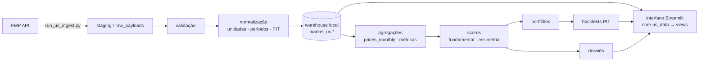

# Empresas Americanas — arquitetura e runbook

Seção de análise fundamentalista de empresas dos EUA (NYSE/Nasdaq/AMEX),
inspirada em Empresas B3, Portfólio B3 e Carteira de FIIs. **Offline-first**:
a interface lê apenas o **warehouse local** (`market_us.*`); a API (Financial
Modeling Prep) é usada só na ingestão.

> Estado atual: **Fases 2–4 implementadas** (infraestrutura, ingestão mínima,
> normalização/qualidade, point-in-time). As fases de análise (score, comparação
> por indústria, dossiê), portfólio/backtests e "Fora da Curva" entram nas
> próximas iterações — as abas correspondentes já existem na UI, marcadas como
> em construção.

## Fluxo de dados



A interface **nunca** chama a FMP: o caminho `FMP → UI` não existe. A chave
`FMP_API_KEY` só é lida pela CLI/pipeline.

---

## Relatório de auditoria (itens 4–8)

### 4. Arquivos novos

| Arquivo | Papel |
|---|---|
| `supabase_unificado/schema/040_market_us_schema.sql` | Schema `market_us.*` (idempotente, PIT) |
| `core/us_methodology.py` | Versões de schema/score |
| `core/us_read.py` | Leitura SQL do warehouse (offline-first) |
| `core/us_data.py` | Facade cacheada que a **view** importa |
| `data_pipeline/us/providers.py` | `MarketDataProvider`/`FundamentalsProvider`/`FmpProvider` |
| `data_pipeline/us/normalize.py` | Unidades, períodos, PIT, sem zero-fill |
| `data_pipeline/us/identity.py` | CIK, aliases, divergência de símbolo, universo |
| `data_pipeline/us/repository.py` | Upsert idempotente + runs/erros/qualidade |
| `data_pipeline/us/quality.py` | Checks (identidade contábil, FCF, market cap) |
| `data_pipeline/us/ingest.py` | Orquestrador por domínio, reiniciável |
| `run_us_ingest.py` | CLI da ingestão |
| `views/empresas_americanas.py` | Seção com 12 abas |
| `tests/test_us_*.py` | Normalização, identidade, provider, repositório, módulo |

**Reutilizados (não reescritos):** `core/database.py` (engine/warehouse),
`core/config.py` (+`FMP_API_KEY`/`has_fmp`), `design/componentes.py` (cards CSS),
`app.py` (+1 rota).

### 5. Esquema de banco

Schema dedicado `market_us` (isolado de `market.*`/`public.*`). Identidade
permanente por **CIK**; símbolo negociável em `assets`; histórico de tickers em
`ticker_aliases`. Tabelas-fato temporais carregam `reference_date`,
`published_date`, `available_at`, `ingested_at`, `currency`, `unit`, `source`,
`content_hash`, `quality_status`. Tabelas: `exchanges`, `companies`, `assets`,
`ticker_aliases`, `income_statements`, `balance_sheets`, `cash_flow_statements`,
`key_metrics`, `prices_daily`, `prices_monthly`, `dividends`, `splits`,
`analyst_estimates`, `market_cap_history`, `sector_industry_history`,
`ingestion_runs`, `ingestion_errors`, `data_quality_audit`, `score_vintages`,
`raw_payloads`. (Portfólio/backtests entram em migration posterior.)

### 6. Endpoints FMP usados

`stock/list` (universo), `profile/{symbol}`, `income-statement/{symbol}`,
`balance-sheet-statement/{symbol}`, `cash-flow-statement/{symbol}`,
`key-metrics/{symbol}`, `historical-price-full/{symbol}`,
`historical-price-full/stock_dividend/{symbol}`,
`historical-price-full/stock_split/{symbol}`. A camada de provedor é abstrata —
trocar/complementar a FMP não exige reescrever a ingestão.

### 7. Riscos

- **Licença FMP**: verifique os termos quanto ao armazenamento perpétuo dos
  dados. O projeto só implementa o armazenamento técnico local.
- **Custo/limite de plano**: a carga inicial completa pode exceder o rate limit;
  use `estimate` (dry-run) antes e faça a carga em lotes durante uma assinatura.
- **Reutilização de ticker/CIK ausente**: empresas sem CIK usam o nome como
  âncora fraca (upsert menos preciso) — documentado no código.
- **Nunca gravar sob ticker errado**: divergência símbolo solicitado × retornado
  é rejeitada (aprendizado do bug brapi do lado B3).

### 8. Plano de execução

Fases 1–4 concluídas (auditoria, infraestrutura, ingestão mínima, normalização/
qualidade/PIT). Próximas: Fase 5 (score por setor, comparação, dossiê),
Fase 6 (carteira + backtest + Rank-IC), Fase 7 (Fora da Curva), Fase 8
(validação/regressão/desempenho).

---

## Configuração

```bash
# .env (nunca commitado). Ver .env.example.
FMP_API_KEY="sua_chave"          # usada SÓ pela ingestão
FMP_BASE_URL="https://financialmodelingprep.com/api"
```

O warehouse local sobe via `warehouse/docker-compose.yml` (Postgres 17, porta
5433). A CLI aponta para ele com `--warehouse` (lê `warehouse/.env`).

## Carga inicial e atualização incremental

```bash
python run_us_ingest.py init-schema --warehouse           # aplica 040 (idempotente)
python run_us_ingest.py test        --warehouse --json     # chave + conexão
python run_us_ingest.py estimate    --tickers AAPL MSFT    # dry-run (sem rede)
python run_us_ingest.py universe    --warehouse --limit 200
python run_us_ingest.py bootstrap   --warehouse --tickers AAPL MSFT --years 20 --json
python run_us_ingest.py resume      --warehouse            # retoma do checkpoint
python run_us_ingest.py daily       --warehouse --tickers AAPL MSFT
python run_us_ingest.py validate    --warehouse --json     # auditoria de qualidade
```

A atualização busca só o que é novo (upsert por chave natural; dividendos/splits
com dedup). O estado por domínio fica em `market_us.ingestion_runs` (retomável);
erros em `market_us.ingestion_errors` (reprocessáveis).

## Modo offline

Após a carga, a interface funciona sem chave e sem rede: lê o último snapshot
válido, informa a data da última atualização e nunca substitui dados válidos por
nulos. Sem dados locais, mostra estado vazio e instruções — não quebra.

## Point-in-time e vieses

Backtests filtram por `available_at` (data em que o filing era conhecível),
nunca por `ingested_at`. Empresas deslistadas permanecem no universo histórico
(anti-survivorship). Divergências de ticker e restatements são detectados
(`content_hash`).

## Limitações conhecidas

- CIK ausente em parte do universo reduz a precisão da identidade.
- Estimativas de analistas/insider/13F dependem do plano/licença da FMP.
- REITs usam FFO/AFFO (P/L e depreciação são inadequados) — tratamento próprio
  entra com a Fase de score.
