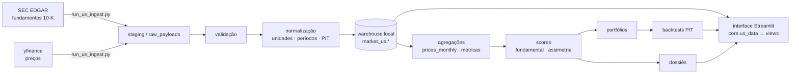

# Empresas Americanas — arquitetura e runbook

Seção de análise fundamentalista de empresas dos EUA (NYSE/Nasdaq/AMEX),
inspirada em Empresas B3, Portfólio B3 e Carteira de FIIs. **Offline-first**:
a interface lê apenas o **warehouse local** (`market_us.*`); as APIs são usadas
só na ingestão.

## Fontes de dados (decisão de 2026-07)

**Padrão: SEC EDGAR** (fundamentos) + **yfinance** (preços). A FMP era a fonte
original do projeto, mas a leitura dos seus Termos de Serviço revelou cláusulas
incompatíveis com o warehouse local: licença revogada ao fim da assinatura
(§2.1), obrigação de **apagar todos os dados, inclusive cache**, ao encerrar
(§6.3, com direito de auditoria), cópia/download exigindo aprovação escrita na
licença pessoal (§2.2.1) e exibição em aplicações multiusuário exigindo acordo
específico (§2.2.2). A EDGAR não tem nada disso: filings são **domínio público**.

Bônus técnico: a EDGAR entrega a **filing date** de cada 10-K, usada como
`available_at` — point-in-time mais rigoroso que o `acceptedDate` da FMP.
Validado ao vivo: AAPL FY2023–FY2025 bate com os 10-K oficiais, com
`available_at` nas datas reais de arquivamento (início de novembro).

Requisitos: `SEC_USER_AGENT` no `.env` ("Nome email@contato" — a SEC exige
identificação, senão responde 403) e ≤ 10 req/s (o provider usa 8). yfinance:
sem SLA (raspa o Yahoo) — aceitável para preço, não para fundamento. A FMP
permanece disponível via `US_FUNDAMENTALS_SOURCE=fmp`, apenas com licença
compatível.

> Estado atual: **módulo completo (Fases 2–8)** — infraestrutura, ingestão,
> normalização/qualidade/PIT (2–4); score fundamentalista + comparação por
> indústria + dossiê (5); carteira-modelo + backtest point-in-time + Rank-IC (6);
> Empresas Fora da Curva, em **seção própria** (7); Análise Avançada
> (Piotroski/Altman/Sloan/ROIC incremental) e validação (8).

## Análise Avançada

`core/us_advanced.py`, determinístico e puro:

- **Piotroski F-Score** (2000) — 9 critérios binários (rentabilidade, alavancagem/
  liquidez, eficiência). Critério sem dado retorna `None` e **não** conta como
  atendido: o score reporta `evaluable` (quantos puderam ser avaliados) e marca
  `partial`. Nunca inflar nota por ausência de dado.
- **Altman Z-Score** (1968) — `1.2·X1 + 1.4·X2 + 3.3·X3 + 0.6·X4 + 1.0·X5`; zonas
  segura (> 2,99) / cinzenta / aflição (< 1,81). Exige `retained_earnings`
  (migration 043) e market cap; sem eles retorna `None`, não um número inventado.
- **Accruals de Sloan** (1996) — `(lucro − CFO) / ativos médios`; menor é melhor.
- **ROIC incremental** — `ΔNOPAT / Δcapital investido`; `None` quando o capital
  investido não cresceu (denominador ≤ 0 não é interpretável).

> `python run_us_ingest.py init-schema --warehouse` aplica **todas** as migrations
> `market_us` em ordem (040 → 043), de forma idempotente.

## Empresas Fora da Curva — SEÇÃO PRÓPRIA (Fase 7)

Não é aba desta seção: é uma **seção separada no menu**
(`views/empresas_fora_da_curva.py`), porque o propósito é outro e misturar as
duas leituras confunde a decisão.

| | Empresas Americanas | Empresas Fora da Curva |
|---|---|---|
| Pergunta | O que a empresa **já entrega**? | Há **retorno assimétrico** possível? |
| Erro esperado | Baixo | **Alto por construção** |
| Posição | Normal (carteira-modelo) | **Subcarteira pequena** |
| Saída | Score + carteira + backtest | **Hipótese** com sinais/riscos/invalidação |

Aceita maior incerteza porque grandes vencedoras são raras e poucas posições
podem responder por grande parte do retorno. A saída **nunca** é recomendação
automática.

`core/us_asymmetry.py` combina nível e **trajetória** (tendência de margem,
persistência de crescimento, diluição, SBC/receita, anos de FCF positivo) em um
score 0–100, com sinais negativos penalizando (diluição excessiva, SBC
descontrolada, dívida alta, FCF negativo persistente, crescimento sem retorno
sobre capital). Produz estágio, confiança (por cobertura de dados), classe de
risco e **tamanho de posição sugerido baixo** (subcarteira pequena).

`core/us_outlier_backtest.py` faz o backtest **retrospectivo**: rótulos
configuráveis (ex.: 3× em 5 anos), precisão/recall, falsos positivos, **lift
sobre a taxa-base** (comparação determinística com seleção aleatória),
distribuição de retornos, **contribuição das maiores vencedoras** e o resultado
quando parte das posições **vai a zero**. O rótulo usa o futuro apenas como
alvo — nunca como feature.

## Carteira e backtest (Fase 6)

A carteira-modelo é construída ao vivo a partir do universo com score, com tetos
por posição e por setor aplicados por **capping iterativo** (heurística de
projeção, não otimizador de média-variância). O backtest é **walk-forward
point-in-time**: os scores são recomputados a cada data-base usando só
observações com `available_at ≤ data` (sem look-ahead), e comparados ao
equal-weight do universo. Métricas: Rank-IC médio, t-stat, p-valor, hit rate,
excesso sobre EW, Sharpe/Sortino/Calmar, drawdown e turnover.

```bash
# computa o histórico PIT de scores (sem rede; usa o que já está no warehouse)
python run_us_ingest.py score-history --warehouse --start-year 2014 --end-year 2025 --json
# roda o backtest sobre o painel PIT
python run_us_ingest.py backtest --warehouse --top-n 20 --json
```

## Fluxo de dados



A interface **nunca** chama API externa: o caminho `fonte → UI` não existe.
Credenciais/identificação (`SEC_USER_AGENT`, e `FMP_API_KEY` se usada) são lidas
só pela CLI/pipeline.

---

## Relatório de auditoria (itens 4–8)

### 4. Arquivos novos

| Arquivo | Papel |
|---|---|
| `supabase_unificado/schema/040_market_us_schema.sql` | Schema `market_us.*` (idempotente, PIT) |
| `core/us_methodology.py` | Versões de schema/score |
| `core/us_read.py` | Leitura SQL do warehouse (offline-first) |
| `core/us_data.py` | Facade cacheada que a **view** importa |
| `data_pipeline/us/providers.py` | `MarketDataProvider`/`FundamentalsProvider`/`FmpProvider` |
| `data_pipeline/us/normalize.py` | Unidades, períodos, PIT, sem zero-fill |
| `data_pipeline/us/identity.py` | CIK, aliases, divergência de símbolo, universo |
| `data_pipeline/us/repository.py` | Upsert idempotente + runs/erros/qualidade |
| `data_pipeline/us/quality.py` | Checks (identidade contábil, FCF, market cap) |
| `data_pipeline/us/ingest.py` | Orquestrador por domínio, reiniciável |
| `run_us_ingest.py` | CLI da ingestão |
| `views/empresas_americanas.py` | Seção com 12 abas |
| `tests/test_us_*.py` | Normalização, identidade, provider, repositório, módulo |

**Reutilizados (não reescritos):** `core/database.py` (engine/warehouse),
`core/config.py` (+`FMP_API_KEY`/`has_fmp`), `design/componentes.py` (cards CSS),
`app.py` (+1 rota).

### 5. Esquema de banco

Schema dedicado `market_us` (isolado de `market.*`/`public.*`). Identidade
permanente por **CIK**; símbolo negociável em `assets`; histórico de tickers em
`ticker_aliases`. Tabelas-fato temporais carregam `reference_date`,
`published_date`, `available_at`, `ingested_at`, `currency`, `unit`, `source`,
`content_hash`, `quality_status`. Tabelas: `exchanges`, `companies`, `assets`,
`ticker_aliases`, `income_statements`, `balance_sheets`, `cash_flow_statements`,
`key_metrics`, `prices_daily`, `prices_monthly`, `dividends`, `splits`,
`analyst_estimates`, `market_cap_history`, `sector_industry_history`,
`ingestion_runs`, `ingestion_errors`, `data_quality_audit`, `score_vintages`,
`raw_payloads`. (Portfólio/backtests entram em migration posterior.)

### 6. Endpoints usados

**SEC EDGAR (padrão)**: `www.sec.gov/files/company_tickers_exchange.json`
(universo com bolsa), `data.sec.gov/submissions/CIK##########.json` (perfil),
`data.sec.gov/api/xbrl/companyfacts/CIK##########.json` (todas as demonstrações
XBRL de uma vez). **yfinance**: `Ticker.history()` (OHLCV ajustado, dividendos,
splits). **FMP (opcional)**: `stock/list`, `profile`, `income-statement`,
`balance-sheet-statement`, `cash-flow-statement`, `key-metrics`,
`historical-price-full/*`. A camada de provedor é abstrata — trocar a fonte não
exige reescrever a ingestão (foi exatamente assim que a migração FMP→EDGAR foi
feita).

### 7. Riscos

- **Cobertura EDGAR**: só empresas que arquivam na SEC (inclui ADRs com 20-F em
  fase futura; hoje só 10-K anual). Setor vem do código SIC, menos granular que
  a taxonomia GICS da FMP.
- **yfinance sem SLA**: raspa o Yahoo; pode quebrar sem aviso. Aceitável para
  preço (dado replicado), inadequado para fundamento — que por isso vem da SEC.
- **Reutilização de ticker/CIK ausente**: empresas sem CIK usam o nome como
  âncora fraca (upsert menos preciso) — documentado no código.
- **Nunca gravar sob ticker errado**: divergência símbolo solicitado × retornado
  é rejeitada (aprendizado do bug brapi do lado B3).
- **FMP (se reativada)**: os Termos exigem apagar os dados ao encerrar a
  assinatura — incompatível com warehouse permanente sem autorização escrita.

### 8. Plano de execução

Fases 1–4 concluídas (auditoria, infraestrutura, ingestão mínima, normalização/
qualidade/PIT). Próximas: Fase 5 (score por setor, comparação, dossiê),
Fase 6 (carteira + backtest + Rank-IC), Fase 7 (Fora da Curva), Fase 8
(validação/regressão/desempenho).

---

## Configuração

```bash
# .env (nunca commitado). Ver .env.example.
SEC_USER_AGENT="Seu Nome seu@email.com"   # exigido pela SEC (identificação, não segredo)
US_FUNDAMENTALS_SOURCE="edgar"            # padrão; 'fmp' só com licença compatível
```

O warehouse local sobe via `warehouse/docker-compose.yml` (Postgres 17, porta
5433). A CLI aponta para ele com `--warehouse` (lê `warehouse/.env`).

## Carga inicial e atualização incremental

```bash
python run_us_ingest.py init-schema --warehouse           # aplica 040 (idempotente)
python run_us_ingest.py test        --warehouse --json     # chave + conexão
python run_us_ingest.py estimate    --tickers AAPL MSFT    # dry-run (sem rede)
python run_us_ingest.py universe    --warehouse --limit 200
python run_us_ingest.py bootstrap   --warehouse --tickers AAPL MSFT --years 20 --json
python run_us_ingest.py resume      --warehouse            # retoma do checkpoint
python run_us_ingest.py daily       --warehouse --tickers AAPL MSFT
python run_us_ingest.py validate    --warehouse --json     # auditoria de qualidade
```

A atualização busca só o que é novo (upsert por chave natural; dividendos/splits
com dedup). O estado por domínio fica em `market_us.ingestion_runs` (retomável);
erros em `market_us.ingestion_errors` (reprocessáveis).

## Modo offline

Após a carga, a interface funciona sem chave e sem rede: lê o último snapshot
válido, informa a data da última atualização e nunca substitui dados válidos por
nulos. Sem dados locais, mostra estado vazio e instruções — não quebra.

## Point-in-time e vieses

Backtests filtram por `available_at` (data em que o filing era conhecível),
nunca por `ingested_at`. Empresas deslistadas permanecem no universo histórico
(anti-survivorship). Divergências de ticker e restatements são detectados
(`content_hash`).

## Limitações conhecidas

- CIK ausente em parte do universo reduz a precisão da identidade.
- Estimativas de analistas/insider/13F dependem do plano/licença da FMP.
- REITs usam FFO/AFFO (P/L e depreciação são inadequados) — tratamento próprio
  entra com a Fase de score.
