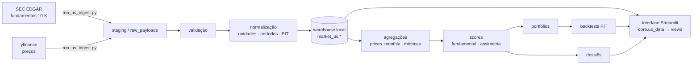

# Empresas Americanas — arquitetura e guia operacional

Seção de análise fundamentalista de empresas dos EUA (NYSE/Nasdaq/AMEX),
inspirada em Empresas B3, Portfólio B3 e Carteira de FIIs. A operação local é
prioritária: a interface lê apenas o **armazém de dados local** (`market_us.*`); as APIs são usadas
só na ingestão.

## Localização em português do Brasil

A interface apresenta textos, filtros, mensagens, indicadores, tabelas, gráficos,
setores e indústrias em português do Brasil. As classificações SEC/SIC são
consolidadas nos setores macroeconômicos usados pela plataforma e traduzidas na
camada de apresentação. Os valores originais permanecem preservados internamente
para busca, auditoria e cálculos. Nomes oficiais de empresas, tickers, bolsas,
siglas regulatórias e nomes próprios de metodologias não são traduzidos.

## Fontes de dados (decisão de 2026-07)

**Padrão: SEC EDGAR** (fundamentos) + **yfinance** (preços). A FMP era a fonte
original do projeto, mas a leitura dos seus Termos de Serviço revelou cláusulas
incompatíveis com o warehouse local: licença revogada ao fim da assinatura
(§2.1), obrigação de **apagar todos os dados, inclusive cache**, ao encerrar
(§6.3, com direito de auditoria), cópia/download exigindo aprovação escrita na
licença pessoal (§2.2.1) e exibição em aplicações multiusuário exigindo acordo
específico (§2.2.2). A EDGAR não tem nada disso: filings são **domínio público**.

Bônus técnico: a EDGAR entrega a **filing date** de cada 10-K, usada como
`available_at` — point-in-time mais rigoroso que o `acceptedDate` da FMP.
Validado ao vivo: AAPL FY2023–FY2025 bate com os 10-K oficiais, com
`available_at` nas datas reais de arquivamento (início de novembro).

Requisitos: `SEC_USER_AGENT` no `.env` ("Nome email@contato" — a SEC exige
identificação, senão responde 403) e ≤ 10 req/s (o provider usa 8). yfinance:
sem SLA (raspa o Yahoo) — aceitável para preço, não para fundamento. A FMP
permanece disponível via `US_FUNDAMENTALS_SOURCE=fmp`, apenas com licença
compatível.

> Estado atual: **módulo completo e alinhado à navegação de Empresas B3** — infraestrutura, ingestão,
> normalização/qualidade/PIT (2–4); score fundamentalista + comparação por
> indústria + dossiê (5); carteira-modelo + backtest point-in-time + Rank-IC (6);
> Análise Avançada
> (Piotroski/Altman/Sloan/ROIC incremental), comparação, criação/simulação e
> avaliação de portfólio, regime macro americano e validação (8+).

## Score fundamentalista — SBC e diluição (v0.5.0, 2026-07)

A auditoria percentual de 2026-07 avaliou o tratamento de **stock-based
compensation em 55%** e de **diluição em 72%**: nenhum dos dois era fator do
score, embora o dado já estivesse ingerido (SBC presente em ~89% das linhas
anuais de fluxo de caixa, 2.782 símbolos). O `US_FUNDAMENTAL_SCORE_VERSION`
passou a `0.5.0` com três métricas novas em `core/us_metrics.py`:

| Métrica | Trilha | Direção | Por quê |
|---|---|---|---|
| `sbc_to_revenue` | Qualidade | menor é melhor | SBC é despesa econômica real do acionista; o peso sobre a receita separa quem paga o time em caixa de quem paga em participação |
| `fcf_ex_sbc_margin` | Qualidade | maior é melhor | o FCF GAAP **soma a SBC de volta** (sai do lucro, retorna no fluxo operacional) e infla a margem de caixa; esta é a margem depois de absorvê-la |
| `share_count_cagr_3y` | Retorno ao acionista | menor é melhor | recompra só cria valor se a base acionária encolher; emissão por SBC pode anular o buyback — negativo = recompra líquida efetiva |

Regras preservadas: ausência **nunca** vira zero (reduz cobertura e confiança);
o sinal do SBC varia por filer e é tratado em módulo; scores anteriores seguem
consultáveis em `market_us.score_vintages` pela versão antiga. A interface
mostra as três métricas no painel da empresa e a variação da base acionária na
tabela de retorno ao acionista, com alerta quando a diluição passa de 2% a.a.

Para recomputar o histórico PIT com a nova versão:

```bash
python run_us_ingest.py score-history
```

## Análise Avançada

`core/us_advanced.py`, determinístico e puro:

- **Piotroski F-Score** (2000) — 9 critérios binários (rentabilidade, alavancagem/
  liquidez, eficiência). Critério sem dado retorna `None` e **não** conta como
  atendido: o score reporta `evaluable` (quantos puderam ser avaliados) e marca
  `partial`. Nunca inflar nota por ausência de dado.
- **Altman Z-Score** (1968) — `1.2·X1 + 1.4·X2 + 3.3·X3 + 0.6·X4 + 1.0·X5`; zonas
  segura (> 2,99) / cinzenta / aflição (< 1,81). Exige `retained_earnings`
  (migration 043) e market cap; sem eles retorna `None`, não um número inventado.
- **Accruals de Sloan** (1996) — `(lucro − CFO) / ativos médios`; menor é melhor.
- **ROIC incremental** — `ΔNOPAT / Δcapital investido`; `None` quando o capital
  investido não cresceu (denominador ≤ 0 não é interpretável).

> `python run_us_ingest.py init-schema --warehouse` aplica **todas** as migrations
> `market_us` em ordem (040 → 043), de forma idempotente.

## Carteira e backtest (Fase 6)

A carteira-modelo é construída ao vivo a partir do universo com score, com tetos
por posição e por setor aplicados por **capping iterativo** (heurística de
projeção, não otimizador de média-variância). O backtest é **walk-forward
point-in-time**: os scores são recomputados a cada data-base usando só
observações com `available_at ≤ data` (sem look-ahead), e comparados ao
equal-weight do universo. Métricas: Rank-IC médio, t-stat, p-valor, hit rate,
excesso sobre EW, Sharpe/Sortino/Calmar, drawdown e turnover.

```bash
# computa o histórico PIT de scores (sem rede; usa o que já está no warehouse)
python run_us_ingest.py score-history --warehouse --start-year 2014 --end-year 2025 --json
# roda o backtest sobre o painel PIT
python run_us_ingest.py backtest --warehouse --top-n 20 --json
```

## Fluxo de dados



A interface **nunca** chama API externa: o caminho `fonte → UI` não existe.
Credenciais/identificação (`SEC_USER_AGENT`, e `FMP_API_KEY` se usada) são lidas
só pela CLI/pipeline.

---

## Relatório de auditoria (itens 4–8)

### 4. Arquivos novos

| Arquivo | Papel |
|---|---|
| `supabase_unificado/schema/040_market_us_schema.sql` | Schema `market_us.*` (idempotente, PIT) |
| `core/us_methodology.py` | Versões de schema/score |
| `core/us_read.py` | Leitura SQL do warehouse (offline-first) |
| `core/us_data.py` | Facade cacheada que a **view** importa |
| `data_pipeline/us/providers.py` | `MarketDataProvider`/`FundamentalsProvider`/`FmpProvider` |
| `data_pipeline/us/normalize.py` | Unidades, períodos, PIT, sem zero-fill |
| `data_pipeline/us/identity.py` | CIK, aliases, divergência de símbolo, universo |
| `data_pipeline/us/repository.py` | Upsert idempotente + runs/erros/qualidade |
| `data_pipeline/us/quality.py` | Checks (identidade contábil, FCF, market cap) |
| `data_pipeline/us/ingest.py` | Orquestrador por domínio, reiniciável |
| `run_us_ingest.py` | CLI da ingestão |
| `views/empresas_americanas.py` | Seção com as mesmas 5 áreas principais da B3 |
| `core/market_companies.py` | Contrato normalizado B3/EUA, filtros e busca |
| `design/market_companies.py` | Abas, busca, cabeçalhos e cards compartilhados |
| `tests/test_us_*.py` | Normalização, identidade, provider, repositório, módulo |

**Reutilizados (não reescritos):** `core/database.py` (engine/warehouse),
`core/config.py` (+`FMP_API_KEY`/`has_fmp`), `design/componentes.py` e
`design/market_companies.py` (cards CSS compartilhados),
`app.py` (+1 rota).

### 5. Esquema de banco

Schema dedicado `market_us` (isolado de `market.*`/`public.*`). Identidade
permanente por **CIK**; símbolo negociável em `assets`; histórico de tickers em
`ticker_aliases`. Tabelas-fato temporais carregam `reference_date`,
`published_date`, `available_at`, `ingested_at`, `currency`, `unit`, `source`,
`content_hash`, `quality_status`. Tabelas: `exchanges`, `companies`, `assets`,
`ticker_aliases`, `income_statements`, `balance_sheets`, `cash_flow_statements`,
`key_metrics`, `prices_daily`, `prices_monthly`, `dividends`, `splits`,
`analyst_estimates`, `market_cap_history`, `sector_industry_history`,
`ingestion_runs`, `ingestion_errors`, `data_quality_audit`, `score_vintages`,
`raw_payloads`. (Portfólio/backtests entram em migration posterior.)

### 6. Endpoints usados

**SEC EDGAR (padrão)**: `www.sec.gov/files/company_tickers_exchange.json`
(universo com bolsa), `data.sec.gov/submissions/CIK##########.json` (perfil),
`data.sec.gov/api/xbrl/companyfacts/CIK##########.json` (todas as demonstrações
XBRL de uma vez). **yfinance**: `Ticker.history()` (OHLCV ajustado, dividendos,
splits). **FMP (opcional)**: `stock/list`, `profile`, `income-statement`,
`balance-sheet-statement`, `cash-flow-statement`, `key-metrics`,
`historical-price-full/*`. A camada de provedor é abstrata — trocar a fonte não
exige reescrever a ingestão (foi exatamente assim que a migração FMP→EDGAR foi
feita).

### 7. Riscos

- **Cobertura EDGAR**: só empresas que arquivam na SEC (inclui ADRs com 20-F em
  fase futura; hoje só 10-K anual). Setor vem do código SIC, menos granular que
  a taxonomia GICS da FMP.
- **yfinance sem SLA**: raspa o Yahoo; pode quebrar sem aviso. Aceitável para
  preço (dado replicado), inadequado para fundamento — que por isso vem da SEC.
- **Reutilização de ticker/CIK ausente**: empresas sem CIK usam o nome como
  âncora fraca (upsert menos preciso) — documentado no código.
- **Nunca gravar sob ticker errado**: divergência símbolo solicitado × retornado
  é rejeitada (aprendizado do bug brapi do lado B3).
- **FMP (se reativada)**: os Termos exigem apagar os dados ao encerrar a
  assinatura — incompatível com warehouse permanente sem autorização escrita.

### 8. Plano de execução

Fases 1–4 concluídas (auditoria, infraestrutura, ingestão mínima, normalização/
qualidade/PIT). Próximas: Fase 5 (score por setor, comparação, dossiê),
Fase 6 (carteira + backtest + Rank-IC), Fase 7 (Fora da Curva), Fase 8
(validação/regressão/desempenho).

---

## Configuração

```bash
# .env (nunca commitado). Ver .env.example.
SEC_USER_AGENT="Seu Nome seu@email.com"   # exigido pela SEC (identificação, não segredo)
US_FUNDAMENTALS_SOURCE="edgar"            # padrão; 'fmp' só com licença compatível
```

O warehouse local sobe via `warehouse/docker-compose.yml` (Postgres 17, porta
5433). A CLI aponta para ele com `--warehouse` (lê `warehouse/.env`).

## Carga inicial e atualização incremental

```bash
python run_us_ingest.py init-schema --warehouse           # aplica 040 (idempotente)
python run_us_ingest.py test        --warehouse --json     # chave + conexão
python run_us_ingest.py estimate    --tickers AAPL MSFT    # dry-run (sem rede)
python run_us_ingest.py universe    --warehouse --limit 200
python run_us_ingest.py bootstrap   --warehouse --tickers AAPL MSFT --years 20 --json
python run_us_ingest.py resume      --warehouse            # retoma do checkpoint
python run_us_ingest.py daily       --warehouse --tickers AAPL MSFT
python run_us_ingest.py validate    --warehouse --json     # auditoria de qualidade
```

A atualização busca só o que é novo (upsert por chave natural; dividendos/splits
com dedup). O estado por domínio fica em `market_us.ingestion_runs` (retomável);
erros em `market_us.ingestion_errors` (reprocessáveis).

## Vitrine no Supabase (deploy)

Por padrão os dados dos EUA ficam **só no warehouse local** — o Streamlit Cloud
lê o Supabase, que não guarda os históricos pesados. Para o deploy mostrar dados,
publique a **vitrine** (`market_us.company_snapshots`): uma linha por empresa com
score, dossiê, assimetria e análise avançada **já computados** (poucos KB cada) —
mesmo padrão da vitrine de FIIs.

```powershell
# no warehouse: constrói a vitrine a partir do que já foi ingerido (sem rede)
python run_us_ingest.py snapshot --warehouse --json
# publica no Supabase (conexão direta). Faça primeiro com --dry-run
python scripts/publish_us_snapshot.py `
  --source-url "postgresql://postgres:<senha>@127.0.0.1:5433/postgres" `
  --target-url "<SUPABASE_UNIFICADO_URL>"
```

`core/us_data` roteia sozinho: com as tabelas completas (warehouse) calcula ao
vivo; só com a vitrine (deploy) lê os produtos publicados. A migration 044 é
**autossuficiente** (cria o schema e não tem FK), pois no Supabase as demais
tabelas `market_us` não existem.

### Painel PIT na vitrine (2026-08-29)

O **backtest PIT** era local-only, e por isso não existia: o portão "Painel PIT"
nunca abria no ambiente publicado, o Rank-IC fora da amostra ficava preso à
janela que já estava medida (−9,93% a +7,37%) e a caixa "exigir validação
histórica" vinha desabilitada. Ele não exige o histórico completo — exige duas
tabelas, que agora vão à nuvem junto da vitrine:

```powershell
python -m scripts.publish_us_score_vintages           # simula
python -m scripts.publish_us_score_vintages --apply   # grava
```

O script publica **só a safra da metodologia corrente** (publicar outra encheria
a vitrine de linhas que o leitor filtra fora) e o **preço mensal inteiro** dos
símbolos dessa safra — não só os meses de rebalanço, porque é o fim da série de
cada símbolo que distingue "o dado acabou" de "a ação acabou"; numa grade só de
junhos, quem quebrou em setembro sairia pelo preço de junho e o backtest voltaria
a ser otimista. Migration `057_market_us_score_vintages_vitrine.sql`; o script
também cria o que grava, para não depender de a migration ter sido executada.

Duas presunções foram removidas junto, porque as duas respondiam antes de
perguntar: o painel declarava prontidão por `market_us.companies` — tabela que
ele não lê e que a vitrine nunca teve — e a tela zerava o painel sempre que o
modo era vitrine.

## Modo offline

Após a carga, a interface funciona sem chave e sem rede: lê o último snapshot
válido, informa a data da última atualização e nunca substitui dados válidos por
nulos. Sem dados locais, mostra estado vazio e instruções — não quebra.

## Point-in-time e vieses

Backtests filtram por `available_at` (data em que o filing era conhecível),
nunca por `ingested_at`. Empresas deslistadas permanecem no universo histórico
(anti-survivorship). Divergências de ticker e restatements são detectados
(`content_hash`).

## Benchmark efetivo no backtest EUA (`us-benchmark-1.0.0`, 17/08/2026)

O seletor da Simulação de Patrimônio agora entrega a escolha ao motor: **S&P 500
(SPY)**, **Russell 1000 (IWB)**, **Nasdaq-100 (QQQ)** ou a opção explícita de
não usar índice. A curva, o retorno anual do índice e o excesso são calculados
contra a seleção, e não contra um índice fixo ou contra pesos iguais disfarçados.

- O equal-weight do universo permanece uma baseline separada: ele mede a
  seleção dentro do universo elegível; o índice mede a estratégia inteira.
- As duas pernas usam `market_us.prices_monthly.adjusted_close`: preço ajustado
  (retorno total), USD e frequência mensal. O motor compara apenas as datas
  comuns e remede a carteira nessa mesma janela.
- A janela do índice segue o painel PIT (12 meses no painel anual). Não há
  conversão de moeda, interpolação ou substituição de lacuna por retorno zero.
- Escolha desconhecida, série ausente ou interseção com menos de três períodos
  falha fechada, com estado nomeado e sem métrica de excesso contra índice.

## Negociabilidade tri-estado e fail-closed (`us-liquidity-2.1.0`, 17/08/2026)

Achado A-004 (severidade alta): **ativo sem medição de liquidez permanecia
elegível por padrão**. O defeito estava replicado em três lugares —
`core/us_liquidity.py::aplicar_piso` (giro `NaN` entrava em `aprovados` e saía
só num aviso), `core/us_portfolio_creation.py` (`if piso > 0 and
"giro_diario_usd" in work` pulava o gate inteiro quando a vitrine não publicava
a coluna) e `views/empresas_americanas.py` (`giro.isna() | (giro >= piso)`).

O argumento que sustentava a permissividade continua válido no que ele de fato
prova: o universo americano tem 3.759 ativos contra 2.752 com série de volume, e
**ausência de medição não é prova de iliquidez** — cortar os 1.007 sem dado
perderia empresa boa por lacuna de coleta. O que não se sustenta é usar esse
argumento para montar carteira: comprar um papel cuja negociabilidade nunca foi
medida é assumir risco não verificado. Os dois usos passaram a ser separados.

| Estado | Significado | Piso > 0 | Piso = 0 (exploratório) |
|---|---|---|---|
| `MEDIDA_APROVADA` | giro finito, data UTC atual e ≥ piso | investível | aparece |
| `MEDIDA_REPROVADA` | giro finito medido, data UTC atual e < piso (inclui zero) | fora | fora |
| `NAO_VERIFICADA` | sem série, `None`, texto vazio/inválido, ±infinito ou data inválida | **fora** | aparece com aviso, não publica |

- `aplicar_piso` devolve `LiquidityScreen` (quatro conjuntos) no lugar da tupla
  de três posições. A quebra de contrato é deliberada: obriga cada chamador a
  tratar o terceiro estado em vez de ler o desconhecido como aprovado.
- **±infinito não é medição.** `float("inf") >= piso` é `True`, e a versão 1.0.0
  aprovava overflow/divisão por zero como se fosse o ativo mais líquido do
  mercado. Agora ±inf é `NAO_VERIFICADA`, como `None` e texto não numérico.
- **Atualidade é UTC e tem intervalo inclusivo de 7 dias corridos.** A data de
  referência do giro precisa ter fuso e estar entre `agora UTC − 7 dias` e
  `agora UTC`, inclusive. Data ausente, inválida, sem fuso, anterior à janela
  ou com timestamp futuro é `NAO_VERIFICADA`; não se presume UTC nem se usa observação futura
  para autorizar uma posição.
- **Coluna ausente bloqueia a publicação.** Com piso > 0 e nenhuma medição
  disponível, `build_portfolio_creation` devolve `blocked=True` e
  `blocking_error` com a instrução de ingestão (`run_us_ingest.py daily
  --warehouse` + `snapshot --warehouse`). Antes devolvia carteira cheia sem
  nenhuma posição verificada.
- A auditoria de exclusões ganhou a linha `liquidity_unverified`, separada de
  `liquidity`: "medido e abaixo do piso" e "nunca medido" são fatos diferentes.
- **Explorar não é publicar.** Com piso zero, ativos não verificados podem ser
  analisados, mas o resultado não pode ser enviado à Avaliação de Portfólio nem
  salvo como carteira padrão até que todas as posições tenham negociabilidade
  verificada.
- `params_to_dict` passou a gravar `liquidity_version`, e
  `PORTFOLIO_SCHEMA_VERSION` foi para `us_portfolio_creation_v3`. As duas chaves
  são **aditivas**: carteiras gravadas com v2 continuam legíveis e nenhum dado
  foi migrado. A staleness continua sendo decidida por `score_version` e
  `model_schema_version`, que não mudaram.

## Limitações conhecidas

- CIK ausente em parte do universo reduz a precisão da identidade.
- Giro diário é mediana de `close × volume` dos últimos 180 pregões
  (`market_us.prices_daily`). Sem a série, o ativo é `NAO_VERIFICADA` e não
  entra em carteira — o que não afirma que ele seja ilíquido.
- Estimativas de analistas/insider/13F dependem do plano/licença da FMP.
- REITs usam FFO/AFFO (P/L e depreciação são inadequados) — tratamento próprio
  entra com a Fase de score.

## Motores avançados na seleção (27/07/2026)

Uma verificação transversal encontrou o mesmo padrão que a carteira B3 expôs:
**motores de diagnóstico que nunca alcançavam a decisão**. No módulo EUA,
`core/us_advanced.py` (Altman Z, Piotroski F, accruals de Sloan, ROIC
incremental) era consumido só por `us_read.py`, na análise individual.

Os números da vitrine mostravam o custo disso: **597 empresas ativas (21%) em
zona de aflição do Altman** e cobertura de 99,9% do Piotroski — tudo calculado,
gravado e ignorado na hora de montar carteira.

### O que mudou

`load_snapshot_scored()` passou a expandir também o bloco `advanced` (antes só
`metrics`), e `build_entry_scores` ganhou três penalidades, no mesmo padrão das
que já existiam:

| Alerta | Peso | Ressalva |
|---|---:|---|
| Altman Z em zona de aflição | 8 | não se aplica a Financial Services e Real Estate |
| Piotroski ≤ 3 de 9 | 6 | só quando ≥ 6 critérios foram avaliáveis |
| Payout > 1,5× o lucro | 7 | REITs isentos (distribuem FFO por exigência legal) |
| Accruals de Sloan > 0,10 | 5 | corte na cauda de ~5% (p95 = 0,112; mediana −0,050) |

**O ROIC incremental ficou deliberadamente de fora.** 39% das empresas que têm
esse dado o apresentam negativo, e a métrica é um delta de dois anos que vira
com uma única queda de EBIT — penalizá-la dispararia em vale de ciclo, o erro
que a §16 da auditoria corrigiu. Segue exibido na análise individual, onde o
contexto do ano está à vista.

### Payout sem esperar re-ingestão

`payout_ratio` passou a ser calculado em `core/us_metrics.py`, mas a vitrine já
publicada foi gerada antes disso — a penalidade nasceria inerte (0 de 2.830
snapshots tinham o campo). `load_snapshot_scored()` deriva o payout do bloco
`financials`, que já traz `dividends_paid` e `net_income` por exercício, usando
o último ano com lucro positivo. Resultado: **1.293 empresas passaram a ter a
métrica imediatamente**, sem re-ingestão, e 111 foram sinalizadas — XRX
distribuindo 151× o lucro, HRI 87×, FSK 71×.

O peso 8 do Altman é deliberado: **sozinho não exclui** (o corte é 10), mas
somado a outro alerta independente exclui. O Z-Score foi calibrado em indústrias
de 1968 e classifica mal empresas asset-light — tratá-lo como veto isolado
reprovaria boas empresas de tecnologia.

### Efeito medido no universo real (2.830 ativas)

| Status | Antes | Depois |
|---|---:|---:|
| Aprovada | 424 | 399 |
| Observação | 1.229 | 1.046 |
| Excluída | 1.177 | 1.385 |

**208 empresas que passavam agora são excluídas** — quase todas por aflição do
Altman confirmada por um segundo alerta independente (liquidez corrente baixa ou
cobertura de juros insuficiente). Nenhuma exclusão vem de um sinal isolado.
